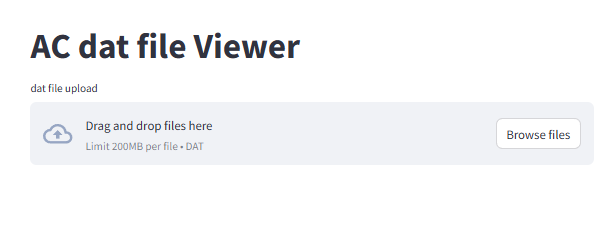
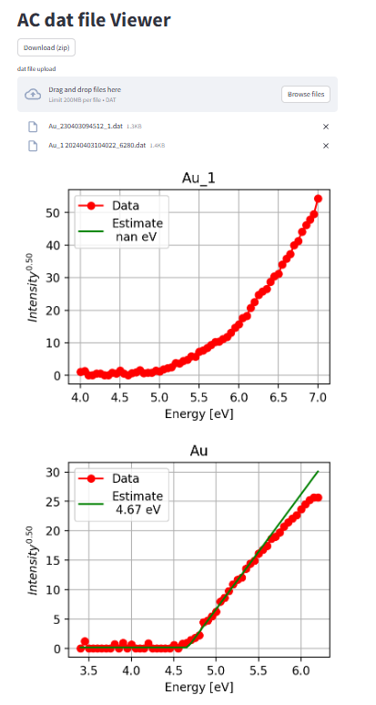

# AcViewer

理研計器ACシリーズで測定したdatファイルをアップロードすると、グラフを表示するプログラムです。

このプログラムはStreamlitで作成されています。

testDataフォルダーにテストデータが入っています。（Auのデータが２つ。）

https://acviewer-lqesa8acrbtrvzd4zpkaes.streamlit.app/

---

Datファイルをドラッグアンドドロップしてください。ファイルを複数ドラッグしても受け付けます。

#### 

Downloadボタンを押すと、個々のグラフをまとめたZipファイルをダウンロードできます。
